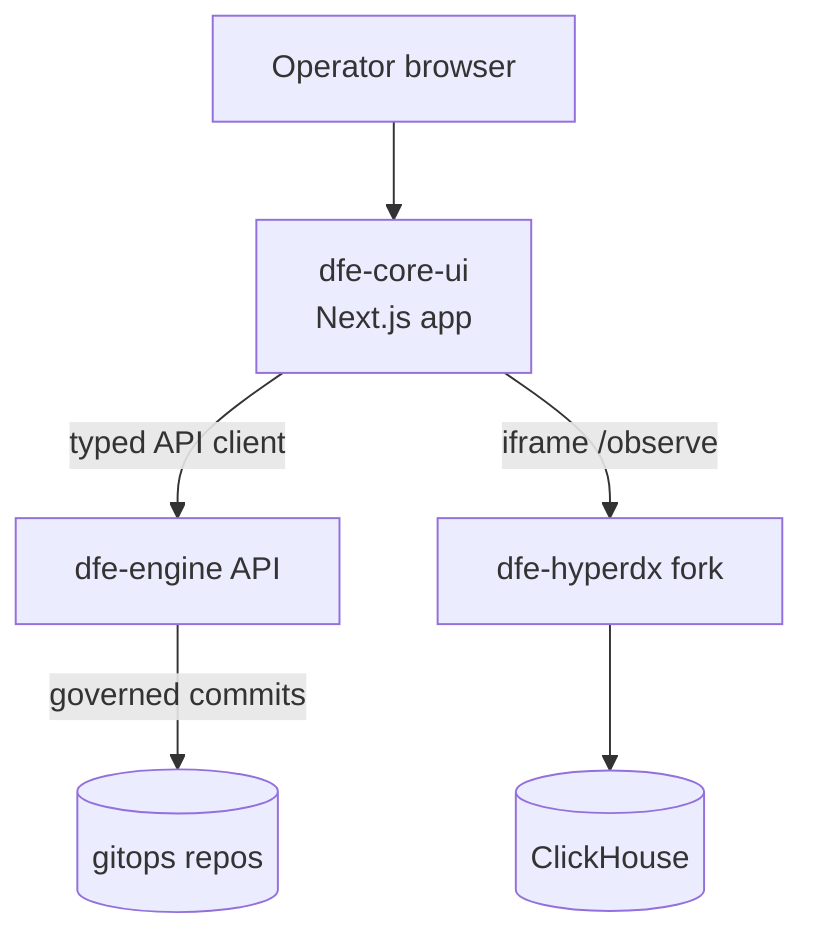
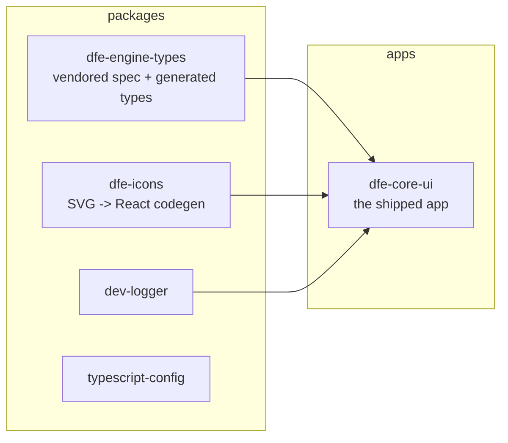

# dfe-ui architecture

dfe-ui is the operator surface of the DFE suite: a Next.js app that talks to
exactly one backend - the dfe-engine API - and embeds the DFE HyperDX fork
for data exploration. It holds no state of its own beyond the browser
session; everything it shows and changes goes through engine endpoints.

## Where it sits in the DFE stack

The control pyramid rule: the UI exposes the well-trodden, high-value 80/20
of the engine API and NEVER reaches past it. If the UI needs data, the
engine grows an endpoint. The whole-suite map lives in the dfe-engine repo
(`docs/architecture.md` there).

## Monorepo map

Only `dfe-core-ui` ships (Next standalone output in a two-stage container).
The packages are build-time dependencies.

## App structure

- Route groups: `(auth)` for the signed-in app, `(no-auth)` for login.
- Feature directories per domain (Hunts, Schemas, Settings, ...) with
  TanStack Query hooks per endpoint.
- The engine seam is one typed client
  ([engine-api-client.md](engine-api-client.md)) - no raw fetch in feature
  code (the only raw fetch sites are the NextAuth server-side callbacks).
- `/observe` iframes the HyperDX fork ([observe-embed.md](observe-embed.md)).
- Auth is NextAuth over local accounts and the engine's OIDC hand-back ([authentication.md](authentication.md)).
