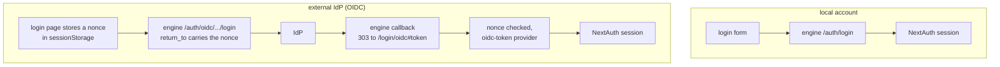

# Authentication

Two ways to sign in, both wired through NextAuth. The UI never runs its own identity provider handshake - identity always comes from the engine.

## Sign-in paths

- **Local account:** the login form posts to the engine's local auth. The console forwards the browser's `X-Forwarded-For` so the engine's audit trail can name the client.
- **OIDC:** the engine is the relying party and re-mints its own token. It returns the browser to `/login/oidc` with the token in the URL fragment. The console accepts that token only when the `login_nonce` on the return URL matches the one the same tab stored when it started the login, so a crafted link carrying someone else's token cannot sign a browser in.

## Session renewal

The browser asks for a renewal by posting to `/api/auth/session` with no token data. The server refreshes the session's engine token against the engine, reads the roles from `/auth/me`, and takes the expiry and the password-change flag from the engine's answer. Nothing the browser sends can set the token, roles, lifetime or flag.

A renewal the engine refuses marks the session expired, and the console signs out to the login page. That covers a session the engine has ended (`session_ended`) and one past its maximum age (`session_expired`).

## Changing your own password

The form asks for the current password as well as the new one; on the forced first-login screen that is the password the deployment issued. A wrong one is marked on the field (`invalid_current_password`). The engine ends every session of the account on a change, so the console signs out and the login page says to sign in with the new password.

## Signing out

`src/app/api/auth/[...nextauth]/route.ts` wraps NextAuth's sign-out. Once NextAuth has cleared its session, the route asks the engine to end every session of the account (`POST /api/v1/auth/logout`) with the session's token, before the response reaches the browser. An engine that is down, or too old to have the route, does not stop the local sign-out.

## The dfe_token cookie

`src/proxy.ts` mirrors the session's engine token into a `dfe_token` cookie scoped to `DFE_COOKIE_DOMAIN`, so the embedded HyperDX signs in as the same user. Signing out expires it with the same Domain and Path, along with the host-only copy the engine's OIDC callback sets.

## Redirects

Every post-login redirect goes through `safeRedirectPath` (`src/core/config/loginCallback.ts`), including NextAuth's own `redirect` callback. A target that resolves off the console's origin - `//host`, `/\host`, another scheme - becomes `/`.

Key files: `src/proxy.ts`, `src/core/config/auth.ts`, `src/core/auth/renewEngineSession.ts`, `src/core/auth/oidcLoginNonce.ts`, the `(no-auth)` login scene.

The suite-wide auth model (one PDP = dfe-engine, `X-Oidc-*` edge seam) is documented engine-side: `docs/control-plane/` in dfe-engine.
