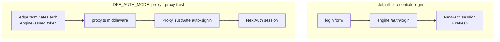

# Authentication

Two sign-in modes, both wired through NextAuth, selected by `DFE_AUTH_MODE`.
The UI never runs its own identity provider handshake - identity comes from
the engine (local accounts) or from the edge (OIDC headers upstream).

## The two modes

- **Credentials (default):** the login scene posts to the engine's local
  auth, and the session refresh flow renews the token via NextAuth
  callbacks.
- **Proxy trust (`DFE_AUTH_MODE=proxy`):** the deployment's edge has
  already authenticated the user (the engine-token check). `proxy.ts` (Next
  middleware, matcher excludes `/login` and `api/auth`) routes fresh
  arrivals through `ProxyTrustGate`, which auto-signs-in via the
  `PROXY_TRUST_PROVIDER_ID` CredentialsProvider registered in
  `core/config/auth.ts`.

Key files: `src/proxy.ts`, `src/core/config/auth.ts`,
`src/core/config/proxyTrust.ts`, the `(no-auth)` login scene.

The suite-wide auth model (one PDP = dfe-engine, `X-Oidc-*` edge seam) is
documented engine-side: `docs/control-plane/` in dfe-engine.
