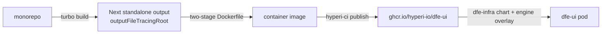

# Build and deploy

One shipped artifact: the `dfe-core-ui` Next.js app as a standalone-output
container, published by hyperi-ci to `ghcr.io/hyperi-io/dfe-ui`. The
packages in the monorepo are build-time only - nothing else is published
(npm publish is opted out).

- **Build:** `yarn build` (turbo). The app uses Next standalone output with
  `outputFileTracingRoot` at the monorepo root so the container carries only
  what the app needs.
- **Container:** two-stage Dockerfile - build stage, then a slim runtime
  copying the standalone output. `NEXT_PUBLIC_*` variables are inlined at
  BUILD time (see [observe-embed.md](observe-embed.md) for the embed
  implication); runtime configuration comes from ordinary env vars.
- **Publish:** hyperi-ci (see `.hyperi-ci.yaml` / Makefile targets) builds
  and pushes the image; semantic-release derives the version - never
  hand-bump.
- **Deploy:** dfe-infra's dfe-ui chart + the engine-authored overlay values
  (the suite deployment model - see dfe-engine `docs/deployment/index.md`).
