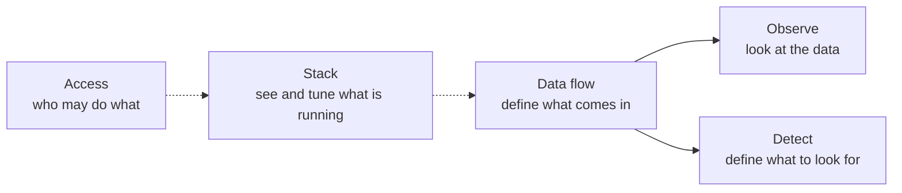
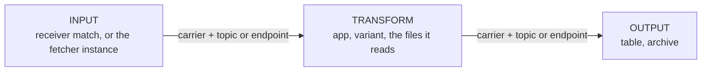

# How the console maps to the flow

A record enters DFE, is optionally reshaped, and lands in a table. The console
is arranged in that order, so a new operator can read the menu top to bottom and
learn how their data moves.

## The five groups

Each group is one RBAC family: a heading appears exactly when at least one
destination under it is the signed-in user's.

| Group | Destinations | What the user does there | RBAC family |
| --- | --- | --- | --- |
| Observe | Search, Saved Searches, Chart Explorer, Dashboards, Hunt Results | look at the data | `dashboard_read` |
| Data flow | Sources, Meta Schemas, Library | define what comes in, how it is shaped, where it lands | `source_*`, `schema_*`, `library_*` |
| Detect | Rules, Hunts | define what to look for | `rule_*`, `hunt_*` |
| Stack | Components, Services, Platform | see and tune what is running | `deployment_*`, `service_*`, `helmvars_*`, `lifecycle_*`, `config_write`, `governance_*` |
| Access | Settings | who may do what | `org_*`, `account_*`, `role_*`, `group_*`, `oidc_*`, `api_key_*` |

The Observe destinations are HyperDX embeds and appear only once a HyperDX URL
is configured.

## Old menu to new

The destinations and their routes are unchanged; what moved is the order and
the grouping.

| Old position | New group | Route |
| --- | --- | --- |
| Search (1st) | Observe | `/observe/search` |
| Saved Searches (2nd) | Observe | `/observe/search/list` |
| Chart Explorer (3rd) | Observe | `/observe/chart` |
| Dashboards (4th) | Observe | `/observe/dashboards` |
| Hunt Results (5th) | Observe | `/observe/hunt-results` |
| Sources (6th) | Data flow | `/sources` |
| Meta Schemas (7th) | Data flow | `/schemas` |
| Library (11th) | Data flow | `/library` |
| Rules (8th) | Detect | `/rules` |
| Hunts (9th) | Detect | `/hunts` |
| Components (10th) | Stack | `/components` |
| Services (12th) | Stack | `/services` |
| Platform (14th) | Stack | `/platform` |
| Settings (13th) | Access | `/settings` |

## The Source page follows the flow

A source's own page opens on **Flow**: three stages and the two arrows between
them.

Every value on that card comes from `GET /api/v1/sources/{name}/flow`, which
returns the engine's own flow resolver. The compilers write each app's deployed
config from the same resolver, so the drawing and the running stack are one
answer rather than two implementations of a naming convention. The console
never builds a topic name or an endpoint of its own.

Three things follow from reading the resolver rather than the source's fields:

- **The effective transport is shown, not the declared one.** A source that
  names no transport takes the deployment's default, and the card says which.
- **A refusal is the engine's own sentence.** When a source's stages cannot run
  as declared -- archiving on a deployment with no bus, a transform app that
  does not carry the chosen transport -- the resolver answers 422 and the card
  shows that message verbatim, beside the choice that caused it.
- **Engine-owned stages are read-only.** A fetcher instance and a transform
  instance are derived from the source, so the card marks them and links to
  where the deployed app is managed rather than offering an edit that would be
  recompiled away.

The same card draws the **default flow** -- where a record the receiver cannot
place lands -- on the Sources page before any source is selected. It answers
before anyone has configured anything, because that flow is already running.

## Where a source's transport and archive are set

Both live on the source form's first tab, beside the name:

- **Transport** -- leave it inherited to follow the deployment default, or name
  `bus` or `direct`. The engine refuses a transport the deployment does not
  offer, at save.
- **Archive** -- keep the raw record as it arrived. The archiver reads the
  landing topic, so this needs the bus.

## Reading an app's shape rather than naming it

The Stack destinations render from `GET /api/v1/apps`, whose entries come from
the app manifest. Nothing in the console is keyed to an app's name:

- `multiplicity` decides where an app appears -- a single deployment serves
  every source and belongs to the fleet; a per-config one belongs to its source
  and appears on that source's page.
- `file_sets` decides whether an app gets a file editor at all.
- `has_compiled_routing` decides whether its routing is derived from the sources
  (and so read-only, with drift re-synced) or hand-set.
- `profiles` says which deployment profiles may run the app, and `default_in`
  which ones run it without being asked. An app nothing deploys by default is
  reported as `optional`, and the console offers it as something to turn on
  rather than something missing.
