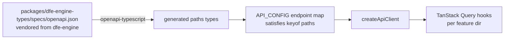

# Engine API client - the typed seam

Every engine call goes through one typed client generated from the engine's
OpenAPI spec. The endpoint map is compile-time checked against the generated
types, so a route that disappears from the spec fails the build, not the
user.

## How the pieces connect

- **Vendored spec:** `packages/dfe-engine-types/specs/openapi.json` - a
  committed copy of the engine's `openapi-spec/openapi.json`.
- **Generated types:** `yarn workspace @repo/dfe-engine-types generate`
  (openapi-typescript) regenerates the `paths` types.
- **Endpoint map:** `apps/dfe-core-ui/src/core/config/api/endpoints/` -
  typed `satisfies Record<string, Record<string, keyof paths>>`, so every
  entry must exist in the spec.
- **Client:** `apps/dfe-core-ui/src/core/config/api/client.ts` - fetch
  wrapper adding auth, JSON handling, and `ApiError`.
- **Hooks:** feature directories wrap endpoints in TanStack Query.

## Re-vendoring the spec

When the engine API changes:

1. Copy the engine's regenerated `openapi-spec/openapi.json` over
   `packages/dfe-engine-types/specs/openapi.json`.
2. `yarn workspace @repo/dfe-engine-types generate`
3. Fix any compile errors in the endpoint map (that is the drift check
   working).

> **Note:** the spec's `info.version` does not change on every engine edit,
> so version alone cannot detect drift - re-vendor whenever engine routes
> change. The type-safety sync mechanics are documented engine-side in
> `docs/control-plane/type-safety-sync.md`.
