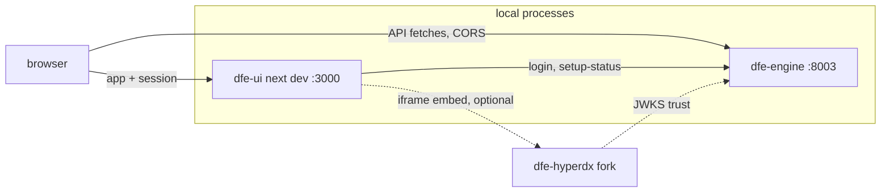

# Local development

The app runs as a plain `next dev` process against a local dfe-engine -- no
containers, no Kubernetes. Node >= 24 with corepack (yarn 4), turbo drives the
workspaces. Bring the engine up first, then one command boots the console.

## Boot the engine first, then the app

The engine is the only backend the console needs. Run it as a local process on
port 8003 per
[dfe-engine docs/LOCAL-DEV.md](https://github.com/hyperi-io/dfe-engine/blob/main/docs/LOCAL-DEV.md),
then:

```bash
corepack enable   # once -- the repo pins yarn 4 via packageManager
yarn install
NEXT_PUBLIC_API_URL=http://localhost:8003 \
INTERNAL_API_URL=http://localhost:8003 \
NEXTAUTH_URL=http://localhost:3000 \
NEXTAUTH_SECRET=any-dev-value \
yarn workspace dfe-core-ui dev --port 3000
```

If `corepack enable` fails with `EACCES` (a system-installed node cannot
symlink into `/usr/bin`), give it a writable directory on your PATH --
`corepack enable --install-directory ~/.local/bin` -- or run every yarn command
through corepack (`corepack yarn install`), which needs no enable. Skipping
corepack and using a yarn 1 from your PATH runs the wrong yarn against this
lockfile.

The app answers on <http://localhost:3000> within seconds. Port 3000 is not a
habit -- the engine's default CORS allowlist breaks login on any other port
(see the gotchas). `yarn dev` (turbo) runs the same app when you do not need
to pass a port.

Sign in at `/login` with an engine account. On a fresh dev engine that is the
bootstrap admin credential (`admin` / `changeme`), and the first sign-in lands
on the `/setup` first-run wizard until initial setup completes.

## The browser and the server both talk straight to the engine

The browser fetches the engine cross-origin (CORS), the Next server calls it
server-side, and NextAuth mints the session from the engine's login endpoint
(`POST /api/v1/auth/login`, then `GET /api/v1/auth/me` for roles). The engine
is also the OIDC issuer (`https://dfe.local/api`) whose ES384 keys are
published at `/.well-known/jwks.json` -- the embedded HyperDX fork trusts
those same keys, riding the `dfe_token` cookie the middleware plants.



The fork iframe is optional for console work. Wiring it up is covered in
[observe-embed.md](observe-embed.md) and the fork's own
[getting-started doc](https://github.com/hyperi-io/dfe-hyperdx/blob/main/docs/development/getting-started.md).

## Every deployment fact is an environment variable

| Variable                                 | When               | Purpose                                                                                     |
| ---------------------------------------- | ------------------ | ------------------------------------------------------------------------------------------- |
| `NEXT_PUBLIC_API_URL`                    | build-time inlined | engine base URL for browser-side fetches                                                    |
| `INTERNAL_API_URL`                       | runtime            | engine base URL for server-side fetches (middleware, NextAuth)                              |
| `NEXTAUTH_URL` / `NEXTAUTH_SECRET`       | runtime            | NextAuth session config -- any non-empty secret works for dev                               |
| `DFE_COOKIE_DOMAIN`                      | runtime            | parent domain for the `dfe_token` cookie -- leave unset locally                             |
| `HYPERDX_URL` / `HYPERDX_PORT`           | runtime            | the embed pair, either shape -- see [observe-embed.md](observe-embed.md)                    |

`NEXT_PUBLIC_*` values are baked in at build time -- `next dev` reads them at
boot, so changing one needs a dev-server restart (a production image needs a
rebuild). `next dev` also loads a gitignored `apps/dfe-core-ui/.env.local` if
present, and explicit shell values win over it (Next.js env precedence).

## Two ports, and 3000 matters

| Port | Owner              | Notes                                                              |
| ---- | ------------------ | ------------------------------------------------------------------ |
| 3000 | dfe-ui `next dev`  | must be 3000, 5173 or 5174 unless the engine's CORS list is extended |
| 8003 | dfe-engine API     | Swagger at `/docs`, JWKS at `/.well-known/jwks.json`               |

## Two curls verify the loop

Both halves, no browser needed:

```bash
curl -s -X POST http://localhost:8003/api/v1/auth/login \
  -H 'Content-Type: application/json' \
  -d '{"username":"admin","password":"changeme"}'
# -> {"access_token":"eyJ...","token_type":"bearer","expires_in":3600,"user_id":"admin","roles":["admin"]}

curl -s -o /dev/null -w '%{http_code}\n' http://localhost:3000/login
# -> 200
```

Then prove it as a user: open <http://localhost:3000/login>, sign in, and land
in the app (the `/setup` wizard on a fresh engine).

## The gotchas that actually bite

- **A non-default port breaks login silently.** The engine's default CORS
  allowlist is `localhost:3000/5173/5174` only. On any other port the login
  page sticks on "Loading setup" and the browser console fills with CORS
  errors on `/api/v1/auth/setup-status`. Extend the engine's
  `DFE_API_CORS_ORIGINS` (comma-separated) or stay on port 3000.
- **A fresh engine bounces `/` to `/setup`.** The middleware consults the
  engine's setup-status on every request. Until initial setup completes,
  everything except `/login` and `/setup` redirects to the wizard -- that is
  first-run behaviour, not a fault.
- **One dev server per checkout.** Next.js refuses a second `next dev` for
  the same app directory and exits with "Another next dev server is already
  running".

## The rest of the daily loop

```bash
yarn test         # vitest across workspaces (turbo)
yarn lint         # eslint via turbo
yarn workspace @repo/dfe-icons storybook   # icon + component workbench
```

After any engine API change, re-vendor the spec and regenerate the typed
client -- the procedure is in [engine-api-client.md](engine-api-client.md).
Contribution mechanics (commit format, DCO, local CI) are in
[CONTRIBUTING.md](../CONTRIBUTING.md).
