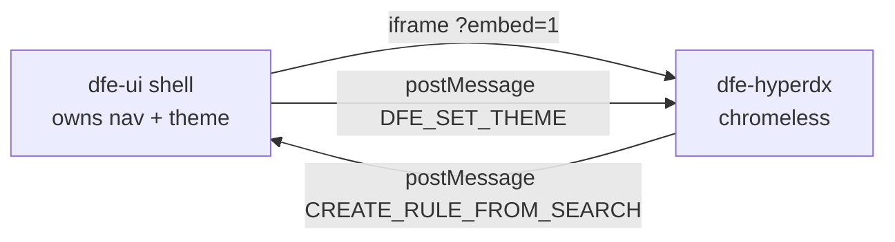

# The /observe embed - HyperDX explore surface

`/observe/[[...feature]]` iframes the DFE HyperDX fork in chromeless mode
(`?embed=1`) so the dfe-ui shell owns navigation while HyperDX provides the
Kibana-style explore over ALL DFE data in ClickHouse. Theme changes are
pushed into the iframe via a `DFE_SET_THEME` postMessage.

## How it is configured today (two mechanisms)

As wired right now, two independent settings control the embed:

- The `/observe` page iframe URL comes from `NEXT_PUBLIC_HYPERDX_URL` -
  a BUILD-TIME inlined variable (the shipped container does not set it, so
  `/observe` reports not-configured in the stock image).
- Sidebar gating and the rule-create postMessage origin check derive
  `${origin}:${HYPERDX_PORT}` at RUNTIME.

Set both consistently in a deployment or the nav and the embed disagree.
The convergence to a single runtime mechanism (single-origin path routing
is the locked design) is tracked in the 2nd-pass review report.

## Rule-create round trip

HyperDX search -> `CREATE_RULE_FROM_SEARCH` postMessage -> dfe-ui listener
acks (`CREATE_RULE_ACK`), stores the payload in IndexedDB (dexie), and opens
the rule editor with `?searchId=`. Detail: [hyperdx-rule-create.md](hyperdx-rule-create.md).
