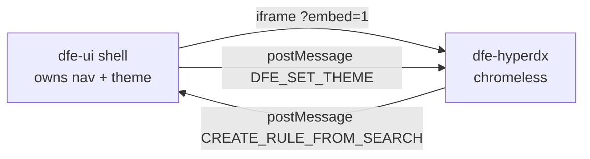

# The /observe embed - HyperDX explore surface

`/observe/[[...feature]]` iframes the DFE HyperDX fork in chromeless mode
(`?embed=1`) so the dfe-ui shell owns navigation while HyperDX provides the
Kibana-style explore over ALL DFE data in ClickHouse. Theme changes are
pushed into the iframe via a `DFE_SET_THEME` postMessage.

## How it is configured

One runtime mechanism, two deployment shapes. The `(auth)` layout reads both
values per request and hands them to `HyperdxContext`; `useHyperdxUrl()` is
the single source the iframe URL, the sidebar gating and the rule-create
postMessage origin check all read.

| Variable      | Shape                                                             |
| ------------- | ----------------------------------------------------------------- |
| `HYPERDX_URL` | HyperDX on its own hostname (k8s gateway: `https://hyperdx.{domain}`). Wins when set. |
| `HYPERDX_PORT`| Same host, different port (docker compose). Host comes from `window.location`, so it is correct for localhost and LAN alike. |

Neither is `NEXT_PUBLIC_`, and that is deliberate: a build-inlined read would
bake the build machine's value into the browser bundle. With neither set,
`/observe` renders "HyperDX is not configured for this deployment."

The origin check is an exact string compare against `event.origin`, so
`HYPERDX_URL` must be a bare origin -- no trailing slash, no path -- or
rule-create messages from the iframe are silently dropped.

The console's Content-Security-Policy frames nothing but this HyperDX: `frame-src` is `HYPERDX_URL`'s origin, or the host the browser used on `HYPERDX_PORT`. A HyperDX reached any other way is blocked in the browser.

## Rule-create round trip

HyperDX search -> `CREATE_RULE_FROM_SEARCH` postMessage -> dfe-ui listener
acks (`CREATE_RULE_ACK`), stores the payload in IndexedDB (dexie), and opens
the rule editor with `?searchId=`. Detail: [hyperdx-rule-create.md](hyperdx-rule-create.md).
